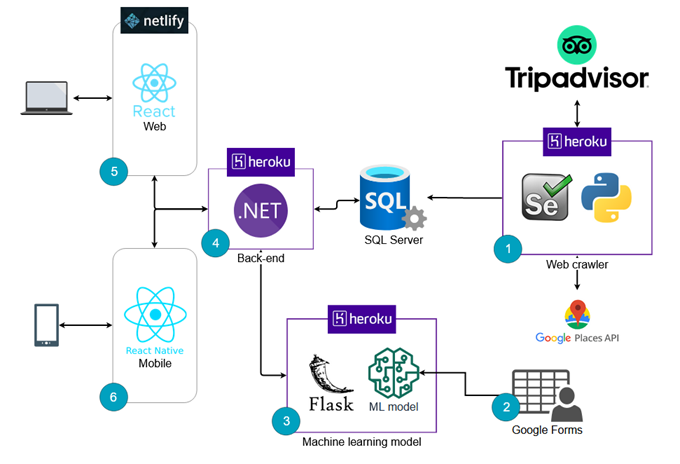

<h1 align='center'>
  
</h1>

<p align="center">
  <a href="#book-about">About</a>&nbsp;&nbsp;&nbsp;|&nbsp;&nbsp;&nbsp;
  <a href="#%EF%B8%8F-technologies">Technologies</a>&nbsp;&nbsp;&nbsp;|&nbsp;&nbsp;&nbsp;
  <a href="#cityscape-solution-architecture">Solution architecture</a>&nbsp;&nbsp;&nbsp;|&nbsp;&nbsp;&nbsp;
  <a href="#gear-config-application">Config application</a>&nbsp;&nbsp;&nbsp;|&nbsp;&nbsp;&nbsp;
  <a href="#-running-the-app">Running the app</a>
</p>

<p align="center">
  
  
  
</p>

## :book: About
This is the mobile app version of IAe, Bora? project and it was developed with React Native, Expo and Typescript.

## ⚒️ Technologies
- [React Native](https://reactnative.dev/)
- [Expo](https://expo.dev/)
- [Typescript](https://www.typescriptlang.org/)
- [React Navigation](https://reactnavigation.org/)
- [React Native Paper](https://callstack.github.io/react-native-paper/)
- [Expo Google Auth](https://docs.expo.dev/versions/latest/sdk/google/)
- [AsyncStorage](https://docs.expo.dev/versions/latest/sdk/async-storage/)
- [Axios](https://github.com/axios/axios)
- [DateTimePicker](https://docs.expo.dev/versions/latest/sdk/date-time-picker/)
- [Lottie](https://github.com/lottie-react-native/lottie-react-native)

## :cityscape: Solution architecture
This repository is represented by the number 6 in the architecture, if you want to view the other repositories of the solution, click on one of the items below:

<p align="center">
  
</p>

- [(1) Web Crawler](https://github.com/iae-bora/abc-tourism-crawler)
- [(3) Machine Learning](https://github.com/iae-bora/ml-api)
- [(4) Back-End](https://github.com/iae-bora/back-end)
- [(5) Front-End](https://github.com/iae-bora/front-end)

## :gear: Config application
Create a `.env` file with the API_URL (from the running back-end URL) and Google Authentication informations.

```
API_URL=

IOS_CLIENT_ID=
ANDROID_CLIENT_ID=
IOS_STANDALONE_APP_CLIENT_ID=
ANDROID_STANDALONE_APP_CLIENT_ID=
```

## 🚀 Running the app

- Install the dependencies with `yarn`
- Start the server with `yarn start`

It will open a web page in **http://localhost:19002** and then you can run it as you like (using the Expo app, Android emulator, IOS emulator...).
